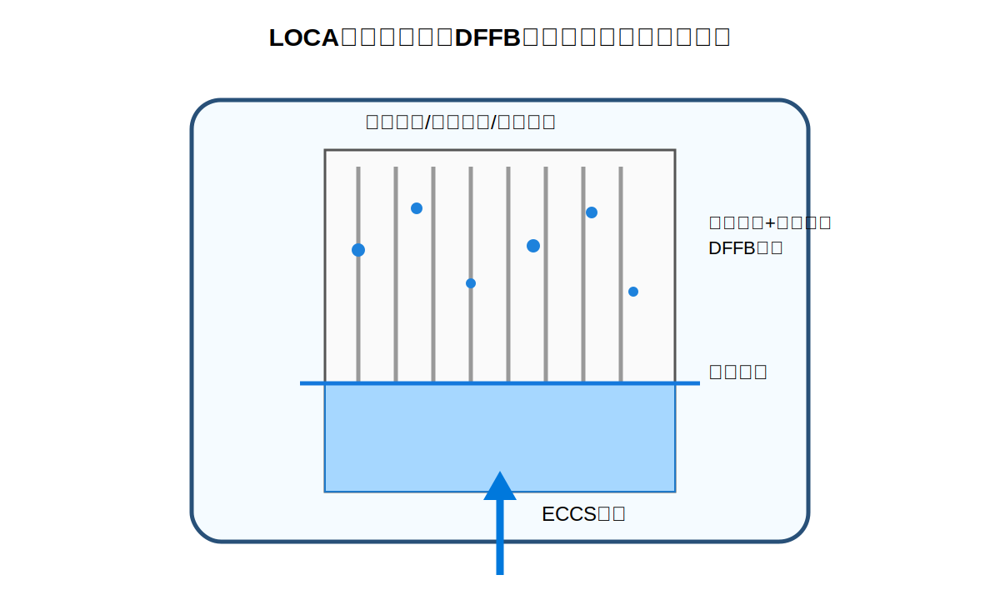
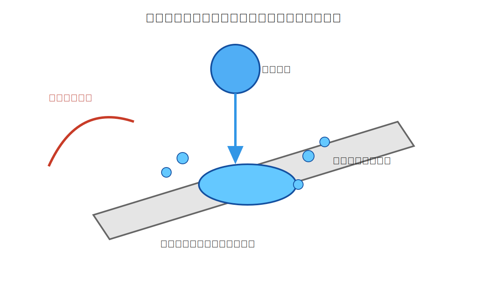
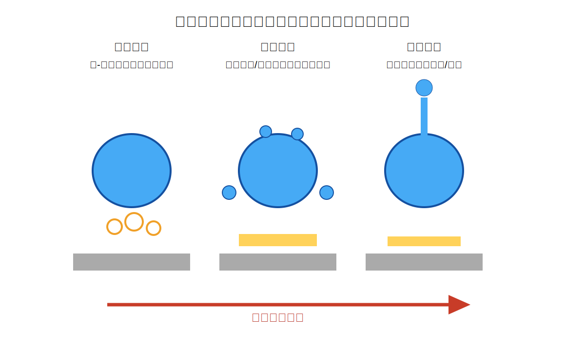
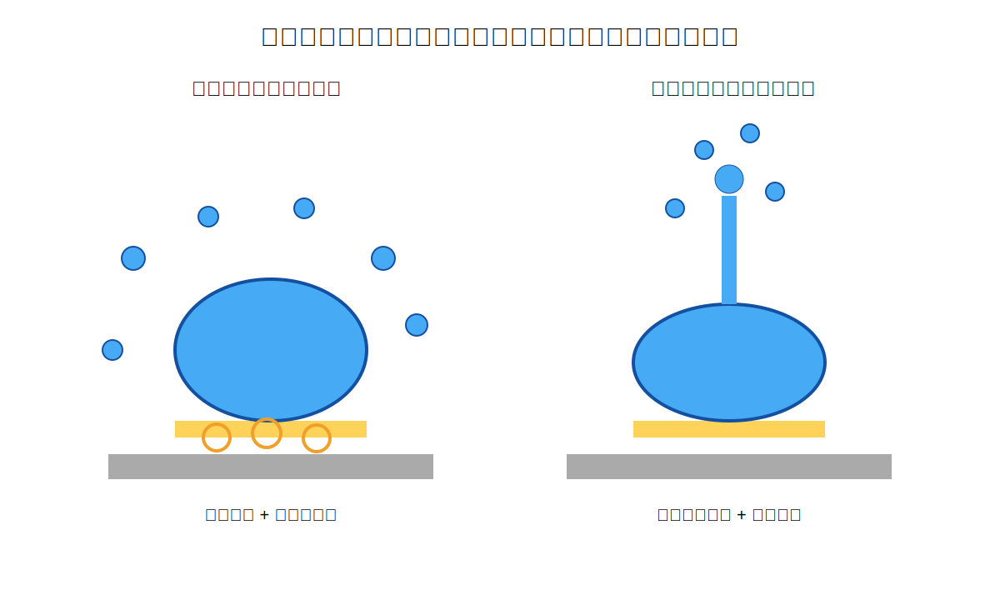

# 第1章 绪论（优化扩写稿与配图建议）

> 本稿针对用户提供的绪论内容进行优化扩写，保留“研究背景与意义—国内外研究现状—现有研究不足—本文主要研究内容”的总体结构。文中插图优先采用本仓库新增的原创示意图，可直接用于论文初稿；若后续需要替换为实物照片或文献图，需按学校要求核对授权并标注来源。

## 绪论配图建议

| 建议图号 | 建议放置位置 | 推荐图片 | 用途说明 | 使用建议 |
|---|---|---|---|---|
| 图1-1 | 1.1 研究背景与意义，介绍 LOCA 再淹没与 DFFB 区域后 | `figures/fig1_pwr_loca_reflood.svg` / `figures/fig1_pwr_loca_reflood.png` | 说明 ECCS 注水、淬灭前沿、上部 DFFB 区域以及液滴-高温结构相互作用背景 | 原创示意图，可直接使用；正式论文中建议改为中文 SVG 版本或按 Word 模板重绘 |
| 图1-2 | 1.1 或 1.2.2，介绍交混翼片局部倾斜结构时 | `figures/fig2_droplet_mixing_vane.svg` / `figures/fig2_droplet_mixing_vane.png` | 说明液滴撞击高温倾斜交混翼片后的非对称铺展、滑移和次级液滴产生 | 原创示意图，可作为机理图使用 |
| 图1-3 | 1.2.1 沸腾模式与破碎机制 | `figures/fig3_boiling_regimes.svg` / `figures/fig3_boiling_regimes.png` | 展示核态沸腾、过渡沸腾和膜态沸腾随壁温升高的演化 | 原创示意图，可配合沸腾状态综述 |
| 图1-4 | 1.2.4 或 1.2.5，讨论雾化机制差异时 | `figures/fig4_atomization_mechanisms.svg` / `figures/fig4_atomization_mechanisms.png` | 对比过渡沸腾整体破碎与膜态沸腾中心射流两种二次雾化机制 | 原创示意图，可用于提出本文研究重点 |
| 图1-5（可选） | 1.2.2 交混翼片与格架研究现状 | Wikimedia Commons: `File:PWR_fuel_assembly.jpg` | 展示压水堆燃料组件实物外观 | CC BY-SA 类图片需注明作者、来源和协议；正式使用前再次核对网页授权 |
| 图1-6（可选） | 1.2.1 Leidenfrost 效应介绍 | Wikimedia Commons 中 Leidenfrost effect 相关公开素材 | 展示液滴在高温表面悬浮/滑移现象 | 优先使用 Public Domain 或 CC BY 素材；若来自论文截图，建议只作为参考并自行重绘 |

## 1 绪论

### 1.1 研究背景与意义

核能作为一种清洁、高效、低碳且可大规模稳定供能的能源形式，在我国能源结构转型和实现“双碳”目标的过程中发挥着不可替代的战略作用[1-2]。与风能、太阳能等波动性新能源相比，核电具有高容量因子、低燃料消耗量和低运行碳排放等特点，可为电力系统提供稳定的基荷电源。截至 2025 年底，我国运行核电机组数量已超过 58 台，在建核电机组规模持续保持全球前列[2]。《“十四五”现代能源体系规划》明确提出“积极安全有序发展核电”，将核电定位为保障国家能源安全、推动绿色低碳转型和提升能源系统韧性的关键支撑[1]。在核电装机容量不断提高、核能利用场景不断拓展的背景下，如何确保反应堆在正常运行、瞬态工况及事故工况下均保持足够安全裕度，是核能可持续发展的基础问题。

压水堆是当前我国核电机组采用最广泛的堆型。压水堆安全分析的核心目标之一，是在假想事故条件下准确预测堆芯冷却能力和燃料包壳温度变化，保证燃料包壳峰值温度（Peak Cladding Temperature，PCT）不超过安全限值[3-4]。失水事故（Loss of Coolant Accident，LOCA）是压水堆设计基准事故分析中的重要场景[3-5]。当一回路冷却剂因管道破口等原因快速流失后，应急堆芯冷却系统（Emergency Core Cooling System，ECCS）会向堆芯注入含硼冷却水，以重新淹没燃料组件并带走衰变热。再淹没阶段中，冷却剂自堆芯底部向上推进，淬灭前沿以下区域逐渐恢复液相冷却，而淬灭前沿上方仍处于高温蒸汽和离散液滴共存的复杂两相流状态。

在再淹没前沿上方，燃料组件处于弥散流膜态沸腾（Dispersed Flow Film Boiling，DFFB）工况。该区域内壁面温度远高于冷却剂饱和温度，液滴随过热蒸汽向上运动，并不断与燃料棒、定位格架和交混翼片等高温固体结构发生碰撞、反弹、破碎、蒸发和再夹带。DFFB 区域的传热效率直接影响燃料包壳的冷却速率，是决定 PCT 预测结果的重要因素[4-6]。若液滴能够被交混翼片破碎为更小尺度的次级液滴，气液界面面积将显著增加，后续蒸发和对流换热能力也会增强；相反，若液滴在高温结构表面形成稳定蒸汽膜并快速弹跳离开，则与壁面的有效热接触时间缩短，换热强化作用受到限制。因此，液滴与高温交混翼片之间的相互作用，是连接局部液滴动力学与堆芯整体冷却性能的重要微观过程。

交混翼片是压水堆燃料组件定位格架中的典型结构[7-8]。其主要作用是在正常运行工况下诱导横向流动、增强子通道间冷却剂混合、改善局部温度分布并提高临界热流密度。在 LOCA 再淹没阶段，交混翼片不仅仍然改变蒸汽-液滴两相流的局部速度场，而且会作为高温倾斜固体表面直接参与液滴破碎和再分配过程。由于交混翼片具有一定倾角，液滴撞击后受到法向惯性、切向速度、重力沿壁面方向分量、蒸汽剪切力和表面张力的共同作用，其铺展、滑移、回缩和破碎行为与水平高温壁面明显不同。液滴在倾斜壁面上形成的液膜厚度通常沿上下游方向不均匀，上游薄液膜区域更易发生边缘剥离和细小液滴喷射，下游厚液膜区域则更可能形成大液滴残留或滑移脱离。这种空间非对称性会进一步影响液滴群粒径分布、喷射方向和界面面积增长。

从传热机理看，液滴撞击高温交混翼片后可能经历核态沸腾、过渡沸腾和膜态沸腾等不同状态[9-11]。当壁面温度相对较低时，液滴与壁面保持直接接触，底部气泡成核、生长与破裂增强局部换热；当壁温升高至过渡沸腾区时，液滴底部局部接触与局部蒸汽隔离交替出现，气泡爆发、压力脉动和液膜惯性失稳共同作用，液滴最容易发生剧烈破碎；当壁温进一步升高并超过动态 Leidenfrost 温度后，液滴底部形成连续蒸汽膜[12-13]，液滴与壁面被隔离，表现为弹跳、膜态飞溅或中心射流等现象。不同沸腾状态下液滴破碎程度差异明显，导致次级液滴数量、粒径分布和总表面积变化规律也不同。

因此，开展液滴撞击高温交混翼片行为研究具有明确的理论价值和工程意义。理论上，该问题涉及液滴撞击动力学、相变传热、蒸汽膜稳定性、界面失稳和二次雾化等多物理过程耦合，有助于深化对高温壁面液滴行为的基础认识。工程上，液滴破碎后的粒径分布和表面积放大倍数可为反应堆安全分析程序中的液滴-格架相互作用模型、DFFB 传热模型和再淹没冷却模型提供实验依据。尤其是在当前安全分析逐步向高保真、机理化方向发展的背景下，获取液滴撞击高温交混翼片的可视化实验数据，并建立壁温、韦伯数与雾化效果之间的关联，对提高事故工况热工水力预测精度具有重要意义。

**建议插图：** 本节可插入“图1-1 LOCA再淹没阶段与DFFB区域示意图”和“图1-2 液滴撞击高温倾斜交混翼片示意图”。前者用于交代反应堆事故背景，后者用于引出本文的局部实验对象。

### 1.2 国内外研究现状

#### 1.2.1 液滴撞击高温壁面的沸腾模式与破碎机制

液滴撞击高温壁面是相变传热和界面动力学领域的重要研究问题。根据壁面温度、液滴初始速度、液滴直径、表面粗糙度和液体物性等条件不同，液滴撞击后可表现为沉积、铺展、回缩、弹跳、飞溅、破碎和蒸发等多种行为[14-16]。从沸腾传热角度看，液滴撞击加热壁面的过程通常可分为单相蒸发、核态沸腾、过渡沸腾和膜态沸腾四类典型模式[9-11]。单相蒸发区内壁温低于液体饱和温度或过热度较小，液滴主要通过显热升温和缓慢蒸发散热；核态沸腾区内，液滴底部与壁面直接接触，气泡在壁面微腔或粗糙结构处成核并迅速生长，气泡破裂强化液滴内部扰动和界面换热；过渡沸腾区内，固-液接触和蒸汽隔离同时存在且高度不稳定，是液滴破碎和强烈喷溅最容易发生的区域；膜态沸腾区内，液滴底部形成连续蒸汽膜，热量主要通过蒸汽膜导热、辐射和蒸汽对流传递，液滴与壁面的直接接触显著减少。

动态 Leidenfrost 温度是判断液滴从过渡沸腾进入膜态沸腾的重要临界温度[12-13]。对于静止液滴，Leidenfrost 现象表现为液滴在高温表面上被蒸汽层托举并长时间悬浮；而对于撞击液滴，液滴具有较大的法向动压，可能压缩甚至局部击穿蒸汽膜，因此动态 Leidenfrost 温度通常高于静态值。已有研究表明，动态 Leidenfrost 温度随撞击速度或韦伯数增加而升高，并受到壁面粗糙度、润湿性、微结构和液体物性影响[12-13,17]。韦伯数越大，液滴惯性越强，稳定蒸汽膜需要更高的蒸汽生成率和承载能力才能抵抗液滴冲击，因此膜态沸腾区的起始温度随之提高。

液滴破碎机制主要可归纳为惯性破碎与热诱导破碎两类[15-16,18]。惯性破碎源于液滴铺展过程中惯性力与表面张力之间的竞争。当液滴以较高速度撞击壁面时，液滴迅速铺展为薄液膜，液膜边缘形成冠状结构、指状扰动或液丝，随后液丝在 Rayleigh-Plateau 不稳定性作用下断裂为次级液滴。热诱导破碎则与气泡成核、生长、聚并和破裂密切相关。在核态沸腾和过渡沸腾区，液滴底部直接接触高温壁面，局部汽化产生的蒸汽泡会向液滴内部膨胀并对液膜施加法向扰动。当气泡破裂或多气泡合并形成瞬时高压区时，可产生微射流、压力波和液膜穿孔，从而诱导液滴破碎。实际高温壁面撞击过程中，惯性破碎与热诱导破碎常常同时发生，尤其在过渡沸腾区表现为强耦合。

对于膜态沸腾区，传统观点认为蒸汽膜隔离会削弱液滴与壁面之间的直接换热，并降低热诱导破碎强度。然而，近年来研究发现，在高壁温或高韦伯数条件下，即使液滴底部存在蒸汽膜，液滴仍可能发生膜态飞溅、中心射流或二次雾化。一方面，液滴高速铺展为极薄液膜后，蒸汽膜压力分布来不及均匀化，局部高压区会造成液膜穿孔和边缘飞溅；另一方面，蒸汽膜下方的压力汇聚或液滴回缩流动的中心汇聚，可能将液体向外顶起形成中心射流。射流后续在表面张力不稳定性作用下断裂为次级液滴[19-20]。由此可见，膜态沸腾并不意味着液滴一定保持完整，其二次雾化机制与过渡沸腾区的气泡爆发破碎存在本质差异。

倾斜壁面进一步增加了液滴撞击过程的复杂性。与水平壁面相比，倾斜壁面上液滴具有沿壁面方向的速度分量，重力也可分解为法向分量和切向分量。液滴撞击后，下游方向铺展距离通常大于上游方向，液膜厚度呈现明显不均匀分布。上游液膜薄、热惯量小，更容易被局部蒸汽压力穿透并产生小液滴；下游液膜厚、液体积聚明显，更可能形成较大碎片或滑移残留。已有数值模拟和可视化实验表明，随着壁面倾角增大，液滴发生飞溅的临界韦伯数可能降低，液滴驻留时间和换热面积也会发生显著变化[21-22]。对于交混翼片这类具有固定倾角和复杂流动扰动的结构，倾斜效应是不可忽略的关键因素。

**建议插图：** 本节可插入“图1-3 液滴撞击高温壁面的沸腾状态演化”，用于帮助读者理解壁温升高时液滴从核态沸腾向过渡沸腾、膜态沸腾的转变。

#### 1.2.2 交混翼片与格架对液滴行为的影响

燃料组件中的定位格架和交混翼片不仅起到定位、支撑燃料棒和保持子通道几何稳定性的作用，还会通过诱导横向流动、增强湍流脉动和促进子通道间质量交换来改善堆芯热工水力性能。在正常运行工况下，交混翼片可破坏燃料棒表面热边界层，增加冷却剂扰动强度，推迟局部干涸和临界热流密度发生[7-8]。在事故再淹没阶段，虽然冷却剂形态由连续液相转变为蒸汽-液滴弥散流，但交混翼片仍会通过改变局部流场和直接碰撞液滴影响液滴尺寸谱和空间分布。

早期关于格架液滴破碎的研究表明，当液滴或液滴群通过干格架或撞击格架结构后，液滴会发生明显机械破碎，下游液滴尺寸谱向小尺度偏移[23-24]。液滴破碎后，单位体积液体对应的表面积增大，有利于蒸汽-液滴之间的传热传质。基于质量守恒、动能守恒和表面能守恒的理论分析，研究者建立了液滴通过格架前后索特平均直径比值的经验关联式，并将其引入系统热工水力分析程序。相关验证表明，考虑格架液滴破碎模型后，程序对全尺度棒束膜态沸腾传热的预测结果能够得到改善[4,23]。这说明格架和交混翼片的液滴破碎效应并非局部细节，而是可能影响再淹没整体传热预测的重要因素。

近年来，计算流体力学方法被广泛用于研究带交混翼格架的流动与换热特性。针对棒束通道的数值模拟表明，交混翼片会在下游形成强烈的旋涡结构和横向速度分量，使速度场、空泡份额、壁面过热度和局部换热系数呈现明显非均匀性[25-26]。对于两相流工况，交混翼片诱导的横向混合能够缓解局部热点，但也会改变液滴轨迹和撞击概率。液滴在接近交混翼片时，可能受到蒸汽横向速度、湍流脉动和翼片几何导向的共同作用，以不同角度和速度撞击翼片表面，从而产生不同破碎模式。

从局部几何角度看，交混翼片可近似视为高温倾斜壁面或薄片结构。液滴撞击这类结构后，除了法向铺展和回缩外，还会沿翼片表面发生滑移或偏转。已有关于加热柱体、倾斜平面和微结构表面的实验研究显示，几何凸起、倾角和表面粗糙度可改变液滴底部蒸汽膜稳定性，使 Leidenfrost 温度和液滴驻留时间发生变化[17,21-22]。对于交混翼片而言，其有限宽度和边缘结构还可能增强液膜边缘失稳，使液滴更容易被撕裂为次级液滴。因此，将高温倾斜壁面作为交混翼片局部模型，研究液滴撞击后的沸腾状态和雾化特性，是连接基础液滴撞击实验与燃料组件实际结构的重要方法。

#### 1.2.3 LOCA 再淹没阶段的两相流与液滴动力学

在 LOCA 再淹没阶段，堆芯内部的两相流结构随时间和空间快速变化[4-6]。ECCS 注入的冷却水在堆芯下部形成液相区域，淬灭前沿向上移动并逐步冷却高温燃料棒；淬灭前沿上方，由于壁温仍然很高，冷却剂以过热蒸汽夹带液滴的形式存在，形成 DFFB 区域。液滴在该区域内可通过与蒸汽的对流换热、蒸发吸热、与壁面或格架碰撞换热等方式带走热量，对燃料棒具有先驱冷却作用。

DFFB 区域的换热效率取决于多个因素，包括液滴直径、液滴速度、液滴数密度、液滴与蒸汽之间的相对速度、壁面温度以及液滴与固体结构的碰撞行为[5-6,23]。小直径液滴具有更大的比表面积，蒸发速度较快；大直径液滴惯性较强，更容易穿透蒸汽流并撞击高温结构。交混翼片对液滴的破碎和再分配会改变液滴尺寸谱，使一部分大液滴转化为多个小液滴，从而增加气液界面面积并改变液滴在子通道中的空间分布。若模型不能准确描述这一过程，就可能低估或高估 DFFB 区域的换热能力，进而影响 PCT 预测。

实验测量方面，相多普勒粒子分析、激光诱导荧光、高速摄像和红外热成像等技术已被用于再淹没两相流研究[27-28]。然而，淬灭前沿附近存在强烈沸腾、相界面遮挡和高温辐射，液滴尺寸、速度和壁面瞬态温度的同步测量仍具有较大难度。因此，许多系统程序中的液滴夹带、沉积和破碎模型仍依赖经验关系。开展可控条件下的单液滴撞击高温交混翼片模拟实验，可以在简化复杂堆芯环境的同时，获得清晰的瞬态图像和可重复的统计数据，为进一步发展机理化模型提供基础。

#### 1.2.4 液滴破碎粒径分布与表面积变化规律

液滴破碎后的粒径分布是评价雾化质量和换热潜力的核心参数。工程上常用概率密度函数、累计体积分布、索特平均直径和表面积放大倍数描述液滴群特性。索特平均直径 D32 表示与实际液滴群具有相同体积-面积比的等效直径，能够直接反映单位体积液体所具有的气液界面面积[29]。D32 越小，说明液滴群越细化，蒸发和换热潜力越强。表面积放大倍数则表示破碎后次级液滴总表面积与初始液滴表面积之比，是衡量液滴破碎对界面面积增长贡献的直观指标。

不同破碎机制会导致不同粒径分布。对于过渡沸腾区，气泡成核位置、气泡生长速率、液膜厚度和局部压力脉动均具有随机性，因此次级液滴通常呈现宽分布或对数正态分布[18-20]。小液滴可由气泡破裂微射流和薄液膜穿孔产生，中等液滴可由边缘液丝断裂产生，大液滴则可能来自母液滴主体撕裂。对于膜态沸腾中心射流，低韦伯数下液滴主要由射流柱断裂产生，粒径分布相对集中；高韦伯数下射流表面波、边缘薄液膜和局部飞溅共同作用，粒径分布向小直径端偏移，但大部分液体可能仍保留在主体液膜或大液滴中。

壁面温度和韦伯数是影响粒径分布的两个关键变量。壁温升高会改变蒸汽生成率、蒸汽膜厚度和局部压力场，进而影响液膜是否发生气泡爆发破碎、膜态飞溅或中心射流。韦伯数增大则意味着液滴惯性增强，铺展液膜更薄，边缘拉伸更强，液滴更容易形成小尺度液丝并断裂。通常情况下，随韦伯数增大，次级液滴平均直径减小，粒径分布峰值向小直径方向移动[15-16,23]。但从表面积放大倍数看，液滴是否发生整体性破碎比单纯产生少量微细液滴更重要。若只有局部液体参与破碎，即使 D32 较小，总表面积增长也可能有限。

**建议插图：** 本节可插入“图1-4 过渡沸腾破碎雾化与膜态沸腾中心射流对比”，用于说明本文后续将重点比较的两种雾化机制。

#### 1.2.5 现有研究不足

综上所述，国内外在液滴撞击高温壁面、交混翼片热工水力特性和 LOCA 再淹没两相流方面已取得较多成果，但针对高温交混翼片条件下液滴破碎和表面积扩大问题，仍存在以下不足。

第一，针对交混翼片倾角特征的高温倾斜壁面实验仍相对不足。现有液滴撞击高温壁面的实验多以水平平板为对象，而实际交混翼片具有明显倾角和有限长度。倾斜壁面导致液滴铺展、滑移、破碎和喷射方向均具有空间非对称性，现有水平壁面结论难以直接推广到交混翼片场景。特别是液膜厚度非均匀分布如何影响气泡成核位置、液膜穿孔位置和次级液滴粒径分布，仍缺乏系统实验数据。

第二，倾斜壁面上的沸腾状态判据尚不完善。对于水平壁面，研究者通常可通过接触时间、反弹高度、底部接触面积或 Leidenfrost 温度判定液滴所处沸腾状态。但在倾斜壁面上，液滴可能同时发生滑移、局部弹跳和边缘破碎，单一指标难以准确区分核态沸腾、过渡沸腾和膜态沸腾。尤其是过渡沸腾区和膜态沸腾区内部还存在破碎雾化、弹跳雾化、膜态飞溅和中心射流等多种现象，需要结合壁温、韦伯数、液滴形态和次级液滴产生方式建立综合判据。

第三，过渡沸腾与膜态沸腾雾化特性的系统对比不足。已有研究多关注某一沸腾状态下的液滴破碎行为，或仅对液滴是否反弹、是否飞溅进行分类。对于过渡沸腾破碎雾化和膜态沸腾中心射流这两种典型二次雾化模式，其形成机制、粒径分布、索特平均直径和表面积放大倍数之间的差异尚未得到充分比较。事实上，两种模式虽然都能产生次级液滴，但过渡沸腾更接近整体性破碎，而中心射流更接近局部性喷射，其对气液界面面积增长和后续换热强化的贡献可能存在显著差别。

第四，现有模型与反应堆安全分析需求之间仍存在差距。系统热工水力程序需要较为简洁但具有物理基础的经验关系，用于描述液滴通过格架或撞击交混翼片后的粒径变化和界面面积变化[4-6,23]。然而，现有经验关系往往基于常温机械破碎或水平壁面实验，难以同时反映壁面高温、相变沸腾、倾斜几何和韦伯数变化的耦合作用。因此，有必要通过可视化实验建立适用于高温倾斜交混翼片条件下的现象图谱和雾化统计关系。

### 1.3 本文主要研究内容

针对上述问题，本文以压水堆 LOCA 再淹没阶段液滴撞击高温交混翼片为工程背景，以高温倾斜壁面模拟交混翼片局部几何特征，采用高速摄像和图像处理方法研究单液滴撞击后的动力学行为、沸腾状态转变和二次雾化特性。主要研究内容如下。

（1）搭建液滴撞击高温倾斜壁面的可视化实验平台并建立参数提取方法。通过液滴生成装置、加热壁面系统、高速摄像系统和背光照明系统，实现不同壁面温度和不同撞击速度条件下单液滴撞击过程的稳定记录。基于高速图像序列建立液滴识别与参数提取程序，获得初始液滴直径、撞击速度、韦伯数、次级液滴数量、等效直径和投影面积等关键参数，为后续定量分析提供数据基础。

（2）研究液滴撞击高温倾斜壁面的典型现象及沸腾状态转变规律。系统比较不同壁温和韦伯数条件下液滴的接触沸腾、滑移、破碎雾化、弹跳雾化、弹跳、膜态飞溅和中心射流等现象，分析液滴与壁面接触状态、蒸汽膜稳定性和液膜非对称铺展特征。构建温度-韦伯数相图，确定核态沸腾、过渡沸腾和膜态沸腾区域及其转变边界，阐明壁温和韦伯数对沸腾状态演化的影响。

（3）揭示倾斜壁面条件下液滴破碎和二次雾化的物理机制。重点分析重力切向分量、切向速度和蒸汽剪切力对液膜厚度分布、破碎起始位置和次级液滴喷射方向的影响。针对过渡沸腾区，讨论局部接触汽化、气泡爆发、液膜穿孔和惯性拉伸共同诱导整体破碎的机制；针对膜态沸腾区，讨论稳定蒸汽膜支撑、局部压力汇聚和 Rayleigh-Plateau 不稳定性诱导中心射流及其断裂的机制。

（4）分析次级液滴粒径分布、索特平均直径和表面积放大规律。对破碎产生的次级液滴进行统计，比较过渡沸腾破碎雾化和膜态沸腾中心射流两种模式下的粒径分布特征，计算索特平均直径和表面积放大倍数，建立其与韦伯数之间的经验关联。通过对比两种雾化模式的界面面积增长效率，评价其对 DFFB 区域后续蒸发换热的潜在影响。

通过上述研究，本文旨在为液滴撞击高温交混翼片的动力学行为识别、沸腾状态判定和二次雾化建模提供实验依据，并为压水堆 LOCA 再淹没阶段 DFFB 区域传热模型的改进提供参考。

## 参考文献

[1] 国家发展改革委, 国家能源局. “十四五”现代能源体系规划[R]. 北京: 国家发展改革委, 2022.

[2] International Atomic Energy Agency. Nuclear Power Reactors in the World: Reference Data Series No. 2[R]. Vienna: IAEA, 2024.

[3] U.S. Nuclear Regulatory Commission. 10 CFR 50.46 Acceptance Criteria for Emergency Core Cooling Systems for Light-Water Nuclear Power Reactors[S]. Washington, DC: NRC.

[4] U.S. Nuclear Regulatory Commission. TRACE V5.0 Theory Manual: Field Equations, Solution Methods, and Physical Models[R]. Washington, DC: NRC, 2010.

[5] Todreas N E, Kazimi M S. Nuclear Systems Volume I: Thermal Hydraulic Fundamentals[M]. 2nd ed. Boca Raton: CRC Press, 2012.

[6] Lahey R T, Moody F J. The Thermal-Hydraulics of a Boiling Water Nuclear Reactor[M]. 2nd ed. La Grange Park: American Nuclear Society, 1993.

[7] Rehme K. Pressure drop correlations for fuel element spacers[J]. Nuclear Technology, 1973, 17(1): 15-23.

[8] In W K, Shin C H, Chun T H. Experimental investigation of turbulent flow in a rod bundle with mixing vanes[J]. Nuclear Engineering and Design, 2001, 204(1-3): 217-229.

[9] Wachters L H J, Westerling N A J. The heat transfer from a hot wall to impinging water drops in the spheroidal state[J]. Chemical Engineering Science, 1966, 21(11): 1047-1056.

[10] Bernardin J D, Mudawar I. The Leidenfrost point: experimental study and assessment of existing models[J]. Journal of Heat Transfer, 1999, 121(4): 894-903.

[11] Quéré D. Leidenfrost dynamics[J]. Annual Review of Fluid Mechanics, 2013, 45: 197-215.

[12] Tran T, Staat H J J, Prosperetti A, Sun C, Lohse D. Drop impact on superheated surfaces[J]. Physical Review Letters, 2012, 108(3): 036101.

[13] Shirota M, van Limbeek M A J, Sun C, Prosperetti A, Lohse D. Dynamic Leidenfrost effect: relevant time and length scales[J]. Physical Review Letters, 2016, 116(6): 064501.

[14] Rein M. Phenomena of liquid drop impact on solid and liquid surfaces[J]. Fluid Dynamics Research, 1993, 12(2): 61-93.

[15] Mundo C, Sommerfeld M, Tropea C. Droplet-wall collisions: experimental studies of the deformation and breakup process[J]. International Journal of Multiphase Flow, 1995, 21(2): 151-173.

[16] Yarin A L. Drop impact dynamics: splashing, spreading, receding, bouncing...[J]. Annual Review of Fluid Mechanics, 2006, 38: 159-192.

[17] Biance A L, Clanet C, Quéré D. Leidenfrost drops[J]. Physics of Fluids, 2003, 15(6): 1632-1637.

[18] Rioboo R, Marengo M, Tropea C. Time evolution of liquid drop impact onto solid, dry surfaces[J]. Experiments in Fluids, 2002, 33: 112-124.

[19] Staat H J J, Tran T, Geerdink B, Riboux G, Sun C, Gordillo J M, Lohse D. Phase diagram for droplet impact on superheated surfaces[J]. Journal of Fluid Mechanics, 2015, 779: R3.

[20] van Limbeek M A J, Shirota M, Sleutel P, Sun C, Prosperetti A, Lohse D. Vapour cooling of poorly conducting hot substrates increases the dynamic Leidenfrost temperature[J]. International Journal of Heat and Mass Transfer, 2016, 97: 101-109.

[21] Šikalo Š, Marengo M, Tropea C, Ganić E N. Analysis of impact of droplets on horizontal surfaces[J]. Experimental Thermal and Fluid Science, 2002, 25(7): 503-510.

[22] Antonini C, Villa F, Bernagozzi I, Amirfazli A, Marengo M. Drop rebound after impact: the role of the receding contact angle[J]. Langmuir, 2013, 29(5): 16045-16050.

[23] Azzopardi B J. Drops in annular two-phase flow[J]. International Journal of Multiphase Flow, 1997, 23(S1): 1-53.

[24] Hewitt G F, Govan A H. Phenomenological modelling of non-equilibrium flows with phase change[J]. International Journal of Heat and Mass Transfer, 1990, 33(2): 229-242.

[25] Karoutas Z, Gu C Y, Scholin B. 3-D flow analyses for design of nuclear fuel spacer grids[C]//Proceedings of the 7th International Meeting on Nuclear Reactor Thermal Hydraulics (NURETH-7). Saratoga Springs, 1995.

[26] Ikeda K, Hoshi M, Yoshimura K. CFD application to improve PWR fuel assembly thermal-hydraulic performance[J]. Nuclear Engineering and Design, 2006, 236(5-6): 633-641.

[27] Andreani M, Yadigaroglu G. Reflooding in a pressurized water reactor: heat transfer and two-phase flow aspects[J]. Nuclear Engineering and Design, 1994, 145(1-2): 121-140.

[28] Piggott B D G, Hewitt G F. Experimental study of droplet deposition in annular two-phase flow[J]. International Journal of Multiphase Flow, 1986, 12(1): 31-48.

[29] Lefebvre A H, McDonell V G. Atomization and Sprays[M]. 2nd ed. Boca Raton: CRC Press, 2017.
